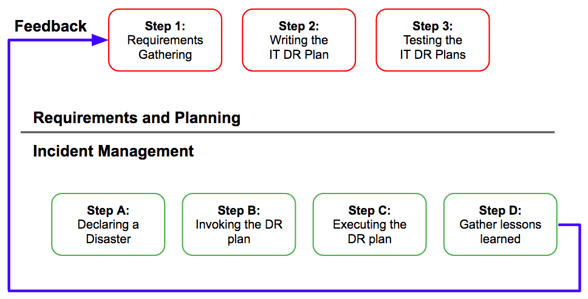

[AppendixA]: #ict-disaster-recovery-plan-template

<table border='1'>
<tr>
<td>This content is a version of the ICT Disaster Recovery Plan and Process Guide, August 2013. 
This is Legacy IA Policy. It is under review and likely to be withdrawn or substantially revised soon. Please contact us before using this on a new project: <a href="mailto:itpolicycontent@digital.justice.gov.uk?subject=ict-disaster-recovery-plan-and-process-guide">itpolicycontent@digital.justice.gov.uk</a>.</td>
</tr>
</table>

## About this document

This document is the Ministry of Justice (MoJ) IT Security – IT Disaster Recovery Plan and Process Guide. It is designed to help protect the information assets of the MoJ through the formal documentation of procedures surrounding the management of IT disaster events.

### How to use this document

This document provides guidance on implementing the MoJ IT Security – IT Disaster Recovery Policy [Ref, 2]. It should be used to guide the development of a MoJ business group level IT Security Disaster Recovery Plan whose scope covers all IT systems used to support that business group.

For the purposes of this document, the following terms will be used:

- **IT Disaster Recovery** will be referred to as **ITDR**.
- **IT Security Incident Management** will be referred to as **ITSIM**.

## Overview

### Introduction

The ability of the Ministry of Justice (MoJ) to react quickly to ITDR events will ensure that losses are minimised and the business will be able to resume or continue operations as quickly as possible.

ITDR management is the ability to react to ITDR events in a controlled, pre-planned manner. Preparation and planning are key factors to successful incident management and all MoJ systems will rely upon the development and implementation of an ITDR plan as described in this guide.

The HMG Security Policy Framework [Ref, 6] Mandatory Requirement 4 states that:

> Departments and Agencies must have robust and well tested policies, procedures and management arrangements in place to respond to, investigate and recover from security incidents or other disruptions to core business.

The policy on IT Disaster Recovery is covered in IT Security Policy – IT Disaster Recovery Policy [Ref, 2] while this document set out the MoJ guidance for creating an ITDR plan. This guide must be read in conjunction with CESG GPG No. 24 – Security Incident Management [Ref, 7] and IT Security – Incident Management Plan and Process Guide [Ref, 4].

Note: The IT Security Policy – IT Disaster Recovery Policy [Ref, 2] sets out the roles and responsibilities with respect to ITDR. It states that each ICT system must fall under the responsibility of an IT Disaster Recovery Team Leader (ITDRTL) who is responsible for maintaining the ITDR plan.

### Aim of this guide

The aim of this guide is to ensure all MoJ business groups develop, implement and maintain an ITDR plan.
This guide is split up into four sections:

- Gathering the requirements needed to shape an ITDR plan;
- Guidance on writing an ITDR plan;
- Testing an ITDR plan;
- Training and awareness.

A template ITDR plan is provided [here][AppendixA]; this is not designed to be a rigid template and can be flexed to meet the needs of the business.

### Demonstration of compliance

The CESG Information Assurance Maturity Model (IAMM) sets out the minimum maturity level Government departments should attain. ICT asset disposal is captured as a basic requirement in Level 1 where the MoJ will need to demonstrate compliance against.

### Relationship to Business Continuity Planning

ITDR is distinct from Business Continuity planning; specifically it:

- Includes planning for resumption of applications, data, hardware, communications (e.g. IT networks) and other IT infrastructure.

The Business Continuity Plan (BCP) is broader than the ITDR in that it puts in place a plan for the recovery of an entire business group's business operation in the event of a disaster. The MoJ's BCP contains the procedures for building, facilities, transport, people, physical information (e.g. paper) disruption and the communication of critical information to employees.

Therefore, an ITDR plans is created:

- To aid the business in returning to normal operations as quickly as possible;
- To ensure the causes of a disastrous event are captured and understood;
- To help avoid similar incidents in the future; and
- To aid the improvement of the ITDR policy and planning.

### Link to IT Security Incident Management

The ITDR plan sits under an ITSIM plan. It is important to ensure that the steps encapsulated in the ITDR plan align to the ITSIM plan. Further information on the ITSIM plan can be found in IT Security – Incident Management Plan and Process Guide [Ref, 4].

### Process

The process for developing a good ITDR plan can be summarised into two stages:

- Firstly a "Requirements and Planning" stage establishes the requirements for the plan.
- Secondly, during "execution" of the ITDR plan, it is important to ensure that ITDR incidents are managed appropriately, the plan is executed effectively, and that any lessons learned are fed back into the process so that future improvements can be made.

Figure 2 is outlines this process.

Figure 2 - ITDR planning and Execution

## Gathering requirements for ITDR

The ITDR process is based on understanding the Recovery Time and Point Objectives; these form the basic requirements for ITDR. This section outlines the process to identify a Recovery Time Objective (RTO) and Recovery Point Objective (RPO) and the information gathering activities required in order to create an ITDR plan.

### ITDR requirements

#### Recovery Time Objective (RTO)

The RTO is the maximum business-tolerable time that an ICT system can be unavailable. This time must be considered from the business' point of view where the RTO covers the entire period from initial failover to successful restoration of the business operations. Simply taking this time to recover a single server is not sufficient.

#### Recovery Point Objective (RPO)

The RPO is the amount of data loss which can be tolerated by the business after a system failover. As such, a business can either re-type or re-generate this amount of information without a significant impact on their business process.

### Information gathering

Table 1 provides details on the base set of information sources required to support the development of an ITDR plan.

| Information source | Description |
|---|---|
| ITDR asset register | The group of ICT systems that are subject to the ITDR planning process must be captured in an ITDR asset register. The RTO and RPO for each individual ICT system must be less than or equal to the overall business group RTO and RPO. |
| Business Impact Assessment (BIA) | For each ICT system identified on the ITDR asset register, a Business Impact Assessment (BIA) is carried out. A BIA considers what impact would occur to the business in the event that the IT systems were unavailable or data were lost. This BIA may be created as part of the Risk Management and Accreditation Document Set (RMADS). |

Table 1 - Information sources.

## Writing an ITDR plan

This section provides guidance on writing an ITDR plan with a template provided [here][AppendixA]. Each sub-section is an element of the ITDR plan.

#### ICT System Description

For the purposes of the ITDR plan, an ICT system is the collection of applications and supporting infrastructure which provides ICT services to a MoJ business group. In turn, this business group supports a number of business processes – it is these processes which must be restored, not just the ICT system.

In order make clear the role of the ICT system with relevance to the BCP, this section must clearly list the ICT system's constituent components, as well as details of the business processes it supports. This in turn defines the scope of the ITDR plan.

#### Site List

This section of the ITDR plan must contain details of all the physical sites relevant to the recovery process. It must also include details of any secondary business sites, in case the primary site is affected by a disaster and ICT system services need to be made available at a secondary site.

#### Dependencies

A list of dependencies (internal and external) must be included in the ITDR plan. Restoration of a business process may be more complex than restoration of a single ICT system, and the bottlenecks or miscommunications which can occur here are often the critical points of failure in the process. The impact of the dependency must be captured, in terms of risk, time and cost.

This information can be used in a disaster event to provide an accurate estimate time for recovery.

##### Internal Dependencies

Internal dependencies are those which may materialise as part of the recovery actions of the ITDR plan itself, for example:

- When a step in the plan must be completed before a subsequent step can be taken, such as restoring access to a database before conducting login testing.
- If the data centre is in a remote part of the country, and so it may take time for staff to reach the location.

##### External Dependencies

External dependencies are those which may affect the success of an ITDR plan and lie beyond the area of control of the ITDR Team Lead (see IT Security – IT Disaster Recovery Policy [Ref, 2] for a role description).

For example:

- Where a previous service, such as power, communication or sanitation facilities, must be restored before this system can be restored;
- Where the recovery of this system must be completed before the Incident Management team can notify staff to return to work at some location.

### Invocation

#### Definition of a 'Disaster'

The ITDR plan must include a clear statement on what set of incidents constitute a disaster. Certain components of the ICT system may be replaceable without invocation of the entire ITDR plan, whereas an apparently 'small' incident may have a wider reach which does require the plan to be invoked. This section must clarify the situations in which the ITDR plan will be invoked; it may be useful to reference incidents which may have occurred in the past.

**Note:** This definition must be consistent with corresponding ITSIM plan.

#### Invocation

The ITDR plan does not need to be invoked in its entirety. A disaster event may not require the invocation of all the procedures in the plan, and so the level of response must be assessed and clearly communicated and agreed between the business and ICT leads before implementation.

This section must list those with authority to invoke the ITDR plan.

#### Staff Notification

Provisions must be made to inform the correct staff of the need to begin recovery procedures; this should usually be captured in the corresponding ITSIM plan.

IT supplier staff may require a different form of notification, and therefore this procedure should be clearly noted in the ITDR plan if they are not contained within the corresponding ITSIM plan.

#### Key Contacts

This section of the ITDR plan should detail the individuals who currently hold the roles listed in the previous section. As mentioned above, this information may be better kept in an annex.

### Recovery procedures

This section of the ITDR plan must list the functions of the ICT system and the business processes it supports, and relate them to a specific set of recovery actions.  Functions should be categorised (into primary and secondary functions) allowing for critical business processes to be restored ahead of others.
A generic set of ITDR incident management steps is [provided](#itdr-incident-management) which should be used as the basis to structure the more granular recovery actions (see [here](#recovery-actions) ).

#### Primary functions

Primary functions are those which **must be** restored in the event of a disaster. The primary functions are the business-centric and mandated processes which must be restored for the business to successfully complete its work.

#### Secondary functions

Secondary functions are those which **should be** restored in the event of a disaster. Priority should be aimed at the primary functions; secondary functions should be restored only after all the primary functions are restored.

#### Recovery actions

This section of the ITDR plan should list any actions which are to be used in the recovery effort and where possible should be cross-referenced with the relevant primary and secondary functions. It is recommended that the ITDR plan contains a high level set of actions (e.g. recover file server) with technical details contained in a referenced work instruction or pre-existing operational procedures document.

### Review

The ITDR plan is a constantly evolving document, and therefore must be subject to change control and review. This should be in line with the review schedule for the corresponding ITSIM plan.

This section of the ITDR plan must define those responsible for the reviews, as well as the conditions under which the review must be undertaken.

## ITDR testing

This section outlines the steps required to develop an effective approach to ITDR testing.

### Types of test

There are five main approaches to testing an ITDR plan:

- Paper-based testing
- Walkthrough testing
- Component testing
- Parallel testing
- Cutover testing

Each approach is summarised in Table 3.

| Test type | Description |
|---|---|
| Paper-based Test | A paper-based test collects together all of the available documentation for the system; most importantly, the ITDR plan for the system. An analyst with experience of conducting ITDR will then ascertain from examining the documented processes and interviews with staff, whether all of the necessary provisions exist to meet the recovery requirements for that IT system. |
| Walkthrough Test | A walkthrough test is a non-technical, real-time test involving a role-play exercise where all relevant stakeholders walk through an ITDR scenario. All resources need to be available and set aside to test a specific scenario; these include business staff, IT staff and accommodation.Where possible it is recommended that the individuals who would be used in a true disaster scenario are used to conduct the test, with the various parties responding as per their role. |
| Component Testing | Component testing starts to test individual components of processes and technology that will be identified in an ITDR plan. Component testing provides an opportunity to gain confidence that the individual components of the IT system can be restored successfully.This type of testing often takes place before progressing to an end-to-end form of testing. |
| Parallel Testing | Parallel testing involves the use of hardware which has been sourced or set aside for the purposes of testing. Essentially, this form of test is operating a full restoration of an IT system in a non-live setting. In this type of testing, the ITDR process is run in parallel alongside the live system, ensuring that the business process can continue to function, while identifying hardware-based, physical and practical limitations of the plan. |
| Cutover Testing | Cutover testing focuses upon putting a disaster recovery system into a live setting. Therefore this involves the complete dependence on the backup system rather than the primary. It is strongly recommended that all previous types of tests are considered and undertaken and reviewed or not taken with formally agreed reasoning to assure confidence before adopting this approach. Care must also be taken to ensure that the live service is not affected during the setup and execution of this test. As with any live service testing, it will be imperative that appropriate service or maintenance windows are identified and agreed with the business, in order to minimise risk to business operations. |

Table 2 – ITDR plan test types

### Planning a test

#### Objectives

The main objectives of testing an ITDR plan are to determine whether:

- ICT services can be recovered after an incident;
- ICT continuity provisions can minimise the impact to the business and their operations, in response to an incident;
- The ITDR procedures for a return to 'business as usual' operations are validated;
- Additional factors, such as communication, and incident and alert management are sufficiently robust; and
- To allow staff to become familiar with the ITDR plan.

The test results must show:

- Gaps in the level of service compared to the ITDR requirements (see [here](#itdr-requirements) ).
- Actions to address these gaps must be identified and assigned to responsible staff.
- A consolidated report for management should be complied, in order to illustrate the results of the tests, along with actions taken to address any issues that arose.
- The process of examining the results against the requirements should identify 'defects' in the Plan documentation and process. These defects must be identified and fed back into the planning documents.

#### Success criteria

A test can only be declared a success if the following conditions are met:

- The business processes which are covered by the ITDR plan are proven to be recovered to working use at the end of the test period.
- The entire ICT system, including data, can be accessed by users within the period of time specified by the agreed RTO limit (see [here](#recovery-time-objective) ).
- Where applicable, users can access the ICT system from a necessary site after the failover has been tested.
- The amount of data loss can be specified exactly, and is within the RPO limit.

**Note:** This is not an exhaustive list, this should be discussed and criteria should be reviewed and agreed with the business group Senior Information Risk Owner (SIRO) in advance.

#### Review and update

Subsequent review of the test must be undertaken to ensure that all test results are reflected in the ITDR plan. It is recommended that this be undertaken as soon as possible after the test is completed.
It is important that any unexpected results arising from the test, which have not been rectified or are still outstanding issues, are document in the ITDR plan including any actions to rectify any defects or issues.

## ITDR Incident management

Table 3 provides a generic set of incident management steps which should be followed when the ITDR plan is invoked. As the ITDR plan sits under an ITSIM plan, it is important to ensure that the steps encapsulated in the ITDR plan aligns to the ITSIM plan.

| Step | Name | Description |
|---|---|---|
| A | Declaring a Disaster | An incident is declared a 'disaster' which requires the ITDR plan to be invoked. |
| B | Invoking the ITDR plan | The IT Disaster Recovery Team Lead identifies the critical resources required to manage the disaster, and puts forward a communications strategy to ensure that all personnel can co-ordinate actions appropriately. |
| C | Executing the DR Plan Procedures | The scope and extent of the disaster is assessed and the ITDR plan is executed following the set of recovery procedures set out in the plan. |
| D | Status Updates | During the recovery process, regular communication points are recommended as part of the ITDR plan to keep the business updated. |
| E | Incident Resolution | Once the ICT system is considered restored to a sufficient level, a final communication to indicate completion should be made to the business. At this point, it is the responsibility of Service Management to declare the system restored. |
| F | Review Results | After the incident has been closed off the 'lessons learned' from the recovery procedure must be reviewed and addressed. In some cases defects in the procedure or plan may come to light.  The aim and objectives of the invocation and requirements must be analysed in light of the information gathered from conducting the execution of the plan. These results will establish if the aims and objectives were met and whether the response to the outage was sufficient. |

Table 3 - Information management steps

## Training and awareness

### Introduction

All staff should be subject to training in order to raise an awareness of the ITDR plan and their individual roles within it.

#### Staff training requirements

Table 4 defines several categories of staff and outlines the recommended training and awareness requirements.

<table border='1'>
<tr valign='top'>
<th>Category</th>
<th>Requirements</th>
</tr>
<tr valign='top'>
<td rowspan='3'>General staff awareness</td>
<td>To know that an ITDR plan exists.</td>
</tr>
<tr valign='top'>
<td>To know how they will be impacted by the range of scenarios covered by the ITDR plan.</td>
</tr>
<tr valign='top'>
<td>To know what to do in the event of an incident or invocation.</td>
</tr>
<tr valign='top'>
<td rowspan='3'>ITDR Representatives</td>
<td>As for general staff, plus: 
To know the responsibilities of a ITDR representative</td>
</tr>
<tr valign='top'>
<td>To know how their departments will be impacted by the range of scenarios covered by the ITDR plan</td>
</tr>
<tr valign='top'>
<td>To ensure their business requirements are communicated and accommodated within the ITDR plan</td>
</tr>
<tr valign='top'>
<td rowspan='2'>Incident management team</td>
<td>As for general staff, plus: 
To understand the requirements of the ITSIM and ITDR plans.</td>
</tr>
<tr valign='top'>
<td>To know their roles in the ITSIM and ITDR plans.</td>
</tr>
<tr valign='top'>
<td rowspan='2'>ITDR recovery staff</td>
<td>As for general staff, plus: 
To understand the IT recovery priorities, plans and processes.</td>
</tr>
<tr valign='top'>
<td>To know their roles in the recovery process.</td>
</tr>
</table>

Table 4 - Staff training requirements

## ICT Disaster Recovery Plan - Template

<table border='1'>
<tr valign='top'>
<th colspan='2' align='center'>IT Disaster Recovery Plan</th>
</tr>
<tr valign='top'>
<th colspan='2' align='center'>Overview</th>
</tr>
<tr valign='top'>
<td>MoJ Business Group</td>
<td>[Enter the name of the MoJ Business Group.]</td>
</tr>
<tr valign='top'>
<td>System Description and Scope</td>
<td>[This section must describe the scope of the ITDR plan. Diagrams may prove useful where there is a complex interaction between systems and business processes covered by this plan. See <a href="#ict-system-description">here</a> for further details]</td>
</tr>
<tr valign='top'>
<td>Site List</td>
<td>[See <a href="#site-list">here</a>]</td>
</tr>
<tr valign='top'>
<td>Definition of a 'Disaster'</td>
<td>[See <a href="#definition-of-a-disaster">here</a>]</td>
</tr>
<tr valign='top'>
<td>Authorised to invoke the plan</td>
<td>[See <a href="#invocation">here</a>]</td>
</tr>
<tr valign='top'>
<td>Staff notification</td>
<td>[Include details of how staff and IT suppliers are notified that ITDR plan has been invoked, see <a href="#staff-notification">here</a>]</td>
</tr>
<tr valign='top'>
<td>Roles and responsibilities</td>
<td>[For each role outlined in the IT Security – IT Disaster Recovery Policy [Ref, 2], a named individual must be entered here.]</td>
</tr>
<tr valign='top'>
<td colspan='2'>Dependencies</td>
</tr>
<tr valign='top'>
<td>Internal Dependencies</td>
<td>[Include each dependency, recommend the following format:
<ul>
<li>Dependency ID;</li>
<li>Description;</li>
<li>Impact (time, resource, effort).</li>
</ul>
See <a href="#internal-dependencies">here</a>]</td>
</tr>
<tr valign='top'>
<td>External Dependencies</td>
<td>[Include each dependency, recommend the following format:
<ul>
<li>Dependency ID;</li>
<li>Description;</li>
<li>Impact (time, resource, effort).</li>
</ul>
See <a href="#external-dependencies">here</a>]</td>
</tr>
<tr valign='top'>
<td colspan='2'>Recovery Procedures</td>
</tr>
<tr valign='top'>
<td>Primary Functions</td>
<td>[Include each primary function, recommend the following format:
<ul>
<li>Function ID;</li>
<li>Function;</li>
<li>Description.</li>
</ul>
See <a href="#primary-functions">here</a>]</td>
</tr>
<tr valign='top'>
<td>Secondary Functions</td>
<td>[Include each primary function, recommend the following format:
<ul>
<li>Function ID;</li>
<li>Function;</li>
<li>Description.</li>
</ul>
See <a href="#secondary-functions">here</a>]</td>
</tr>
<tr valign='top'>
<td>Step [X]</td>
<td>[For each step outlined in <a href="#itdr-incident-management">ITDR Incident Management</a>, list the corresponding recovery procedures in this section; see <a href="#recovery-procedures">Recovery procedures</a> for further details.]</td>
</tr>
<tr valign='top'>
<td colspan='2'>Recovery Actions and Review</td>
</tr>
<tr valign='top'>
<td>Recovery Actions</td>
<td>[See <a href="#recovery-actions">here</a>]</td>
</tr>
<tr valign='top'>
<td>Review</td>
<td>[See <a href="#review">here</a>]</td>
</tr>
<tr valign='top'>
<td colspan='2'>Plan Approval</td>
</tr>
<tr valign='top'>
<td>Business Group SIRO</td>
<td>[Enter the name of the Business Group SIRO] 
[DATE OF APPROVAL]</td>
</tr>
<tr valign='top'>
<td>IT Security Officer</td>
<td>[Enter the name of the IT Security Officer (ITSO)] 
[DATE OF APPROVAL]</td>
</tr>
</table>

Completing this plan can form part of the Accreditation process and must be included and maintained as part of the relevant RMADS.